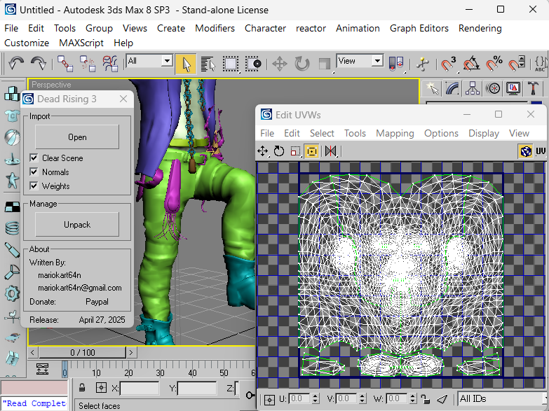

# Dead Rising 3 – 3ds Max Utility



> **Status**: **Import** – fully working for geometry.  
> **Export** – *work-in-progress* (help and pull-requests welcome!).

This MaxScript brings Capcom Vancouver’s ***Dead Rising 3*** assets straight into Autodesk 3 ds Max – meshes, vertex colours, normals, skin weights … and possibly in the future lets you push new content back into the game.

---

## ✨ Features

|               | Import | Export<sup>WIP</sup> |
|---------------|:------:|:--------------------:|
| Static & skinned meshes | ✔ | ⃞ |
| Normals / tangents | optional | ⃞ |
| Skin weights & bone IDs | optional | ⃞ |
| Multiple sub-meshes per model | ✔ | ⃞ |
| Re-packs assets back to **BIG** container | – | ⃞ |

---

## 📥 Installation

1. Clone or download the repo  
   ```bash
   git clone https://github.com/coreynguyen/PC_Dead_Rising_3.git
   ```

2. Copy **dr3_util.ms** into one of Max’s *scripts* folders  
   *(or simply drag-and-drop the file into the viewport).*

3. Run the script – the rollout **“Dead Rising 3”** appears.

---

## 🚀 Usage

| Control | Purpose |
|---------|---------|
| **Open** | Browse to an extracted *.BIG* or individual asset file.<br>Selected file is parsed and built in-scene. |
| **Clear Scene** | Optional – delete all existing objects before import. |
| **Normals** / **Weights** | Toggle reading of extra streams (slower). |
| **Unpack** | Quick link to the separate *unpack* helper (extracts *.BIG* archives to loose files). |

---

## 🛠 Road-map

- [ ] Finish mesh **export** (build vertex & index buffers, update command-buffers).  
- [ ] Material / texture linking.  
- [ ] Animation container research.  
- [ ] Nice “one-click” BIG repacker GUI.


---

## 💸 Donations

If the script saved you hours (or you just love Frank’s poncho), buy me a coffee:

[](https://www.paypal.com/cgi-bin/webscr?cmd=_donations&business=coreynguyen%40gmail%2ecom&item_name=maxscript%20work&currency_code=CAD)

